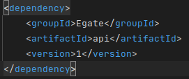
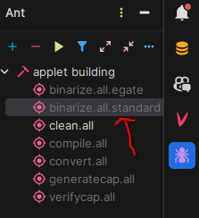

# JavaCard

<p align="center">
  
</p>

## Description

Ce projet est une application Java pour la gestion des cartes à puce. Il utilise Maven pour la gestion des dépendances
et Ant pour les tâches de build. L'application permet de gérer les PINs, envoyer et recevoir des messages, et effectuer
des opérations cryptographiques comme la signature et le chiffrement des messages.

## Prérequis

- Une carte à puce compatible Java Card
- Un lecteur de carte à puce
- Java 8 pour complier l'applet Java Card
- Maven 3.6 ou supérieur pour compiler le projet et gérer les dépendances
- [GPShell](https://kaoh.github.io/globalplatform/) pour installer l'applet sur la carte à puce *(que vous pouvez
  trouver executable pour windows dans le dossier `utils/gpshell`)*
- IntelliJ IDEA

## Code source

Le code source de l'applet Java Card se trouve dans le dossier `src/main/java`. Il est composé d'une seule classe
`CardApplet` qui étend la classe `javacard.framework.Applet` située [ici](src/main/java/polytech/CardApplet.java).

## Dépendances du projet

Vous aurez besoin de enregistrer les dépendances du projet dans votre dépôt local Maven. Pour ce faire, exécutez la
commande suivante pour chaque dépendance qui se trouve dans le `pom.xml` :

```bash
  mvn install:install-file -DgroupId={groupId} -DartifactId={artifactId} -Dversion={version} -Dpackaging=jar -Dfile={PATH_TO_JAR}
```

Par exemple, pour la dépendance `api.jar` :



Ce placer dans ce dossier courant et exécuter la commande suivante :

```bash
  mvn install:install-file -DgroupId=Egate -DartifactId=api -Dversion=1 -Dpackaging=jar -Dfile=utils/Egate/lib/api.jar
```

Car toutes les dépendances se trouvent dans le dossier `utils/Egate/lib/`.

Pour compiler l'applet Java Card, vous aurez besoin de Maven 3.6 ou supérieur. Pour installer les dépendances, exécutez
la commande suivante :

```bash
  mvn install
```

## Compilation de l'applet

Avant de compiler l'applet Java Card, assurez-vous que vous avez bien adapté les constantes `APPLET_AID` et
`APPLET_NAME` et toutes les autres constantes qui se trouve dans le fichier [common.properties](utils/common.properties)

Pour compiler l'applet Java Card, avec IntelliJ IDEA avec le plugin `Ant`, exécutez la tâche `binarize.all.standard` :



et ensuite lancer la commande suivante depuis ce dossier courant :

```bash
  gpshell utils/upload.gp
```


